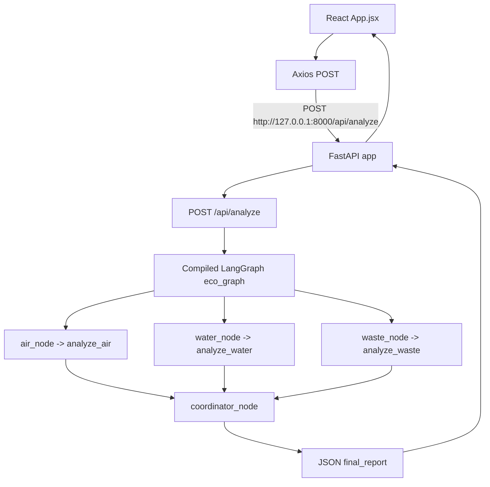

# EcoSentinel System Analysis

## 1. Scope and evidence

This document describes the repository as inspected on 2026-09-20. It is based on the live files in the repository, the current Git working tree, and a limited runtime verification of the Python API and frontend lint command. It does not infer behavior from the project name or from the placeholder README files.

Where a behavior cannot be established from source, it is marked **Not verified from source**.

The application source was not modified during this analysis. The only repository change made by this task is this document.

## 2. Executive summary

EcoSentinel is a small React/Vite frontend backed by a FastAPI service. The backend accepts an area name and three groups of environmental measurements: air AQI, water pH/dissolved oxygen/turbidity, and waste litter count/severity. A LangGraph `StateGraph` runs three deterministic specialist functions in parallel from the graph’s start node, then a coordinator averages their fixed scores and returns a combined report.

The current implementation is a deterministic rules engine, not an LLM-backed or external-sensor system. The waste agent’s docstring mentions an image-based model such as YOLO, but no image upload, model invocation, or image-processing implementation exists in the live source.

There is a current frontend/backend response-contract mismatch. `backend/app/api/routes.py` returns specialist results under `air`, `water`, and `waste`, and contributors under `coordinator.contributors`. The current `frontend/src/App.jsx` instead reads `report.specialist_reports` and `report.contributors`. After a successful HTTP response, those accesses are not present in the backend response and will cause the report rendering path to fail. This is an observed source-level incompatibility, not a proposed fix.

The Git diff shows that the previous version of `App.jsx` used the backend-compatible `report.coordinator?.contributors` and `[report.air, report.water, report.waste].filter(Boolean)`. The current working-tree version has changed those reads to the incompatible names.

## 3. Project inventory

### 3.1 Repository tree

The meaningful repository structure is:

```text
.
├── backend/
│   └── app/
│       ├── agents/
│       ├── api/
│       ├── core/
│       ├── __init__.py
│       ├── main.py
│       └── schemas.py
├── data/
│   ├── knowledge/
│   └── sample/
├── docs/
├── scripts/
├── frontend/
│   ├── public/
│   ├── src/
│   │   └── assets/
│   ├── package.json
│   ├── package-lock.json
│   ├── vite.config.js
│   └── eslint.config.js
├── EcoSentinel-backend.zip
├── EcoSentinel-backend-final.zip
├── EcoSentinel-WORKING-DEMO.zip
├── .gitignore
└── README.md
```

`backend/tests/` also exists as an empty directory in the working tree. The empty directories under `data/`, `docs/`, `scripts/`, `backend/app/rag/`, `backend/app/services/`, and `backend/app/tools/` are not represented by Git files and have no live implementation files.

### 3.2 Production/source files

Backend source:

- `backend/app/main.py`: FastAPI application construction, CORS middleware, health endpoint, and API router registration.
- `backend/app/schemas.py`: Pydantic request models.
- `backend/app/api/routes.py`: `/demo` and `/analyze` HTTP handlers.
- `backend/app/agents/coordinator.py`: LangGraph state, graph nodes, score aggregation, and graph compilation.
- `backend/app/agents/air_agent.py`: deterministic AQI rules.
- `backend/app/agents/water_agent.py`: deterministic water-indicator rules.
- `backend/app/agents/waste_agent.py`: deterministic litter rules.
- `backend/app/**/__init__.py`: package markers; they contain no business logic.

Frontend source:

- `frontend/src/main.jsx`: React root mounting under `#root` and `StrictMode`.
- `frontend/src/App.jsx`: the complete single-page dashboard, form state, HTTP call, response rendering, and error/loading states.
- `frontend/src/index.css`: global and dashboard layout styles.
- `frontend/src/App.css`: component styles imported by `App.jsx`.
- `frontend/index.html`: Vite HTML entry point.
- `frontend/vite.config.js`: React Vite plugin configuration.
- `frontend/eslint.config.js`: ESLint flat configuration.

### 3.3 Configuration and dependency files

- `frontend/package.json` and `frontend/package-lock.json` define the frontend dependencies and scripts. Runtime dependencies are React, React DOM, Axios, and Lucide React. Development dependencies include Vite, the React Vite plugin, ESLint, React Hooks/Refresh plugins, globals, and React type packages.
- No `requirements.txt`, `pyproject.toml`, `Pipfile`, `poetry.lock`, `environment.yml`, or backend dependency manifest is present in the repository. The Python dependencies required by imports are therefore not reproducibly declared by this project tree. A local `.venv` exists but is development-environment state, not a checked-in dependency specification.
- There is no `.env`, `.env.example`, runtime settings module, Dockerfile, Compose file, CI workflow, deployment manifest, or documented production configuration.
- `frontend/vite.config.js` has no proxy, alias, server port, or environment-variable configuration. Vite's default development port is therefore relied upon by the frontend, while the backend explicitly allows common ports 5173–5175 in CORS.

### 3.4 Documentation

- Root `README.md` is empty.
- `frontend/README.md` is the standard React/Vite template README and does not describe EcoSentinel's API or domain behavior.
- This file, `SystemAnalysis.md`, is the first repository-level system analysis document created by this task.

### 3.5 Assets

- `frontend/public/favicon.svg` is used by `frontend/index.html` as the favicon.
- `frontend/public/icons.svg` exists but no live source import/reference was found.
- `frontend/src/assets/hero.png` exists but no live source import/reference was found.
- `frontend/src/assets/react.svg` and `frontend/src/assets/vite.svg` are standard scaffold assets and are not referenced by the live React source.
- Lucide React supplies the icons actually rendered by `App.jsx` (`Activity`, `Wind`, `Droplets`, `Trash2`, `ShieldCheck`, `AlertTriangle`, and `Loader2`).

### 3.6 Generated, development-only, unused, and accidental-looking files

- `frontend/node_modules/` is installed dependency material and is not Git-tracked. It is development/local generated content and is ignored by `frontend/.gitignore`/the root ignore rules.
- `backend/app/**/__pycache__/` and `.pyc` files are Python-generated bytecode. They are not Git-tracked and are ignored by the root `.gitignore`.
- `.venv/` is a local Python virtual environment and is ignored.
- `frontend/node_modules/.vite/` is Vite cache output.
- `frontend/src/assets/react.svg`, `frontend/src/assets/vite.svg`, `frontend/public/icons.svg`, and `hero.png` appear unused from the current source search. Their intended use cannot be verified from source.
- `data/knowledge`, `data/sample`, `docs`, and `scripts` contain no files in the live tree; their intended future roles are not verified from source.
- The root `README.md` and the frontend template README are documentation gaps rather than application logic.

## 4. Archives and duplicate material

Three untracked ZIP files are present:

| Archive | Size | Observed contents | Assessment |
|---|---:|---|---|
| `EcoSentinel-backend.zip` | 20,389 bytes | 31 entries, backend package plus empty `tests`, `rag`, `services`, and `tools` directories and Python bytecode | Backend package snapshot; not imported by live code |
| `EcoSentinel-backend-final.zip` | 20,389 bytes | Same entry count and visible path structure as `EcoSentinel-backend.zip` | Likely a second backend snapshot; archive hashes differ, so byte-for-byte identity is not established |
| `EcoSentinel-WORKING-DEMO.zip` | 31,393,023 bytes | Backend snapshot plus frontend source and a large dependency tree including `frontend/node_modules` | Packaged working-demo artifact; contains generated dependencies and is not the live build input |

The two small backend archives have the same size and visible entry structure but different SHA-256 hashes. **Whether their file contents differ or only archive metadata differs is not verified from source.** The large working-demo archive includes the same major application paths as the live repository and additionally packages generated frontend dependencies. None of the archives is referenced by application code or build configuration.

The archives are untracked working-tree artifacts, as are the current ZIP files themselves. They should be treated as snapshots/packaging artifacts, not authoritative source, unless a release process outside this repository says otherwise.

## 5. High-level architecture

The implemented request path is:



The graph has three outgoing edges from `START` (`air_agent`, `water_agent`, and `waste_agent`) and all three feed `coordinator`. LangGraph determines the execution scheduling; the source does not explicitly create threads or asynchronous functions. The graph is compiled once at module import as `eco_graph = build_graph()` in `backend/app/agents/coordinator.py:137`.

There is no database, persistent storage, message queue, external sensor client, authentication layer, image upload route, model service, or background worker in the live source.

## 6. Backend analysis

### 6.1 Application setup

`backend/app/main.py` creates a FastAPI instance named `app` with title `EcoSentinel`, version `1.0.0`, and description `Environmental Monitoring Multi-Agent System`.

It configures `CORSMiddleware` with credentials enabled, all methods, all headers, and these origins:

- `http://localhost:5173`
- `http://127.0.0.1:5173`
- `http://localhost:5174`
- `http://127.0.0.1:5174`
- `http://localhost:5175`

The router from `backend.app.api.routes` is mounted with prefix `/api`.

`GET /health` returns the literal object:

```json
{
  "status": "ok",
  "service": "EcoSentinel"
}
```

There is no explicit exception handler, request logging setup, authentication, rate limiting, or environment-specific CORS configuration.

### 6.2 Request schemas and validation

`backend/app/schemas.py` defines:

```text
EnvironmentalRequest
├── area: str
├── air: AirInput
│   └── aqi: float, >= 0
├── water: WaterInput
│   ├── ph: float, no Pydantic range constraint
│   ├── dissolved_oxygen: float, >= 0
│   └── turbidity: float, >= 0
└── waste: WasteInput
    ├── litter_count: int, >= 0
    └── severe_litter: bool = False
```

FastAPI/Pydantic performs type conversion and validation before `analyze_environment` runs. The schema does not constrain `area` to non-empty text, does not constrain pH to a domain range, and does not reject unusually large numeric values. The frontend HTML inputs provide some browser-side hints (`min="0"` for AQI/litter count and numeric steps), but the backend remains the authoritative validation boundary.

### 6.3 Routes and input transformation

`backend/app/api/routes.py` defines two synchronous routes.

#### `GET /api/demo`

`demo()` invokes the graph with hard-coded values:

- area: `Demo Area`
- AQI: `187`
- pH: `6.2`
- dissolved oxygen: `3.5`
- turbidity: `12`
- litter count: `25`
- severe litter: `True`

It returns `result["final_report"]`.

#### `POST /api/analyze`

`analyze_environment(request: EnvironmentalRequest)` maps the Pydantic object into the graph state shape:

```text
EnvironmentalRequest.air.aqi                 -> state.air_input.aqi
EnvironmentalRequest.water.ph                -> state.water_input.ph
EnvironmentalRequest.water.dissolved_oxygen  -> state.water_input.dissolved_oxygen
EnvironmentalRequest.water.turbidity         -> state.water_input.turbidity
EnvironmentalRequest.waste.litter_count      -> state.waste_input.litter_count
EnvironmentalRequest.waste.severe_litter     -> state.waste_input.severe_litter
EnvironmentalRequest.area                     -> state.area
```

Both handlers return only `result["final_report"]`, not the full LangGraph state.

### 6.4 LangGraph state and node flow

`backend/app/agents/coordinator.py` defines `EcoState` as a `TypedDict` with optional keys (`total=False`):

- Inputs: `area`, `air_input`, `water_input`, `waste_input`.
- Specialist outputs: `air_report`, `water_report`, `waste_report`.
- Final output: `final_report`.

Node behavior:

- `air_node(state)` reads `state["air_input"]["aqi"]`, calls `analyze_air`, and returns `air_report`.
- `water_node(state)` reads the three water values, calls `analyze_water`, and returns `water_report`.
- `waste_node(state)` reads litter values, calls `analyze_waste`, and returns `waste_report`.
- `coordinator_node(state)` requires all three reports, averages their `score` fields, classifies the average, creates a coordinator report, and returns `final_report`.

The specialist imports are local inside the node functions. This delays those module imports until graph execution, but no plugin or dynamic agent discovery exists.

### 6.5 Specialist algorithms

#### Air: `analyze_air` in `backend/app/agents/air_agent.py`

AQI classification:

- `aqi <= 50` → `LOW`, score `20`.
- `50 < aqi <= 100` → `MEDIUM`, score `50`.
- `aqi > 100` → `HIGH`, score `90`.

Actions are respectively routine monitoring, increased monitoring, or prioritized inspection. The report includes `agent`, `risk_level`, `score`, a fixed `finding`, one `aqi_measurement` evidence object, `confidence: 1.0`, and `recommended_action`.

#### Water: `analyze_water` in `backend/app/agents/water_agent.py`

The score starts at zero and adds independent penalties:

- pH outside `[6.5, 8.5]` → `+40`.
- dissolved oxygen `< 5` → `+35`.
- turbidity `> 5` → `+25`.

Risk classification is:

- score `>= 70` → `HIGH`.
- score `>= 35` and `< 70` → `MEDIUM`.
- score `< 35` → `LOW`.

The function returns a fixed finding, a `water_measurements` evidence object, a `details` list containing one message per indicator, `confidence: 1.0`, and an action that is prioritized only for `HIGH`; all lower levels receive continued monitoring.

The maximum water score is 100 from the three currently implemented penalties. pH itself has no input validation bound, so it can be any float accepted by Pydantic.

#### Waste: `analyze_waste` in `backend/app/agents/waste_agent.py`

- `severe_litter is True` or `litter_count >= 20` → `HIGH`, score `90`.
- Otherwise `litter_count >= 5` → `MEDIUM`, score `50`.
- Otherwise → `LOW`, score `10`.

The report contains a `litter_detection` evidence object, `confidence: 1.0`, and a risk-specific cleanup/monitoring action. The docstring says the inputs represent the output of an image-based detector such as YOLO. No YOLO package, image input schema, image upload route, or detector call is present in the repository; the upstream production of these two values is **Not verified from source**.

### 6.6 Coordinator algorithm and response shape

`coordinator_node` collects `[air_report, water_report, waste_report]`, computes:

```text
average_score = (air.score + water.score + waste.score) / 3
```

Overall risk thresholds:

- average `>= 70` → `HIGH`.
- average `>= 40` and `< 70` → `MEDIUM`.
- average `< 40` → `LOW`.

Contributors are the `agent` values for specialist reports whose individual `risk_level == "HIGH"`. The coordinator reasoning string names the combined level and the high-risk contributors, or `none`.

The current backend response is:

```json
{
  "area": "...",
  "overall_risk": "HIGH|MEDIUM|LOW",
  "air": { "agent": "air", "risk_level": "...", "score": 0, "finding": "...", "evidence": [], "confidence": 1.0, "recommended_action": "..." },
  "water": { "agent": "water", "risk_level": "...", "score": 0, "finding": "...", "evidence": [], "details": [], "confidence": 1.0, "recommended_action": "..." },
  "waste": { "agent": "waste", "risk_level": "...", "score": 0, "finding": "...", "evidence": [], "confidence": 1.0, "recommended_action": "..." },
  "coordinator": {
    "score": 0.0,
    "risk_level": "HIGH|MEDIUM|LOW",
    "reasoning": "...",
    "contributors": []
  }
}
```

The exact numeric evidence types are native Python numeric values serialized by FastAPI. No response Pydantic model is declared, so response shape is enforced only by the functions and dictionary access paths.

## 7. Frontend analysis

### 7.1 Entry and state

`frontend/src/main.jsx` renders `<App />` inside React `StrictMode` at the DOM element with id `root`.

`frontend/src/App.jsx` is a single component with three state values:

- `form`: controlled fields initialized to the demo values (`Demo Area`, AQI 187, pH 6.2, dissolved oxygen 3.5, turbidity 12, litter count 25, severe litter true).
- `report`: initially `null`; set to `response.data` after Axios resolves.
- `loading`: disables the button and changes its content during the request.
- `error`: empty initially; set to a fixed connection message for any caught error.

`handleChange` stores text input values as strings and checkbox values as booleans. `runAnalysis` converts the numeric fields with `Number(...)` before constructing the request payload.

### 7.2 HTTP request

The API URL is a hard-coded constant at `frontend/src/App.jsx:14`:

```text
http://127.0.0.1:8000/api/analyze
```

The payload keys match `EnvironmentalRequest`:

```json
{
  "area": "...",
  "air": { "aqi": 187 },
  "water": { "ph": 6.2, "dissolved_oxygen": 3.5, "turbidity": 12 },
  "waste": { "litter_count": 25, "severe_litter": true }
}
```

Axios errors are logged to the browser console, but the user-facing message does not distinguish validation errors, server errors, CORS errors, timeouts, or rendering failures.

### 7.3 Rendered states

The UI renders:

- A header with branding and a static `System Ready` status.
- An environmental signal form.
- An empty state before analysis.
- An error box when `error` is non-empty.
- A report header with area, reasoning, overall risk, and combined score.
- Contributor pills.
- Three specialist cards with icon, risk, score, confidence, finding, optional details, and recommendation.
- A success message after report state exists.

Icons come from `lucide-react`; the UI does not render the backend evidence arrays. The water `details` array is rendered when present.

### 7.4 Current contract mismatch

The current report branch in `frontend/src/App.jsx` uses:

- `report.coordinator?.reasoning` — compatible with the backend.
- `report.coordinator?.score` — compatible with the backend.
- `report.contributors.map(...)` — incompatible; backend returns `report.coordinator.contributors`.
- `report.specialist_reports.map(...)` — incompatible; backend returns separate `report.air`, `report.water`, and `report.waste` objects.

Therefore the request can succeed at HTTP level while the report render fails when `report.contributors` is accessed as an absent value. The code’s `try/catch` surrounds only the Axios request, not the later React render, so this render failure is not converted into the configured connection error. The prior Git version used the backend-compatible paths, confirming that the mismatch is present in the current working tree rather than implied only by naming.

### 7.5 Styling and assets

Both `frontend/src/index.css` and `frontend/src/App.css` define broad global selectors and overlapping class names such as `.run-button`, `.error-box`, `.risk-badge`, `.risk-high`, `.risk-medium`, `.risk-low`, `.contributors`, and `.agent-card`. `main.jsx` imports `index.css` before `App.jsx` imports `App.css`, so the App stylesheet is imported later and generally wins where selector specificity is equal. This is current CSS cascade behavior; the reason for maintaining duplicate definitions is **Not verified from source**.

The frontend is responsive through media queries in both CSS files. There is no image rendering in `App.jsx`, so the raster and scaffold SVG assets are not part of the active dashboard path.

## 8. End-to-end data flow

1. The user edits controlled form fields in `App`.
2. `runAnalysis` sets `loading`, clears `error`, converts numeric strings, and sends Axios `POST /api/analyze`.
3. FastAPI validates the nested request with `EnvironmentalRequest` and its child models.
4. The route maps model fields to the `EcoState` input keys.
5. `eco_graph` executes the air, water, and waste nodes.
6. Each node calls one deterministic specialist function and adds a report to graph state.
7. The coordinator averages the three scores, determines overall risk, selects high-risk contributors, and constructs `final_report`.
8. The route returns only `final_report` as JSON.
9. Axios stores JSON in `report`.
10. React renders the report branch. With the current field names, this branch does not match the actual response contract and is not expected to complete successfully after a normal successful API response.

## 9. Example calculation from the built-in demo values

For the hard-coded `/api/demo` values and the frontend defaults:

- Air: AQI 187 → `HIGH`, score 90.
- Water: pH 6.2 (`+40`), dissolved oxygen 3.5 (`+35`), turbidity 12 (`+25`) → `HIGH`, score 100.
- Waste: severe litter true and count 25 → `HIGH`, score 90.
- Coordinator: `(90 + 100 + 90) / 3 = 93.33` → `HIGH`.
- Contributors: `air`, `water`, `waste`.

A live TestClient verification against the repository’s `.venv` returned HTTP 200 for both `/health` and `/api/analyze` and produced this shape. The frontend mismatch described above remains after that successful backend response.

## 10. Operational and security observations

These are observations of the current implementation, not fixes:

- The frontend hard-codes a loopback backend URL, so a browser opened from another host cannot use a deployed backend without source/configuration changes.
- CORS allows credentials but the backend defines no authentication or authorization mechanism. **Whether this is acceptable for the intended deployment is Not verified from source.**
- All API routes are synchronous functions. The graph itself is synchronous from the application’s perspective; no queue or job identifier is returned.
- There is no persistence, audit trail, report history, or server-side request correlation ID.
- The response has no declared Pydantic output schema, which allows accidental contract drift without FastAPI response validation.
- Specialist confidence is hard-coded to `1.0`; it is not calculated from measurement quality, model output, provenance, or uncertainty.
- Input values are accepted as measurements but their units are only partly represented by field names and frontend labels. Unit validation/conversion is not implemented.
- There is no explicit handling for specialist exceptions, graph failures, malformed internal state, or downstream timeouts.
- The static frontend `System Ready` label is not connected to `/health`; it is presentation text only.

## 11. Tests and verification status

No test source files are present in the live `backend/tests/` directory, and no frontend test framework or test script is declared in `frontend/package.json`.

Checks performed during this analysis:

- Python imports were verified through the local `.venv`; `fastapi`, `pydantic`, and `langgraph` imported successfully.
- FastAPI `TestClient` returned 200 for `GET /health`.
- FastAPI `TestClient` returned 200 for a valid `POST /api/analyze` and confirmed the response keys described above.
- `npm.cmd run lint` passed from `frontend/`.
- No automated backend test suite, integration test, browser test, production deployment test, or performance test was found.

The exact supported Python versions, installation command, Uvicorn command, and production server configuration are **Not verified from source**. The code imports `backend.app...`, so the repository root must be on Python's import path for the shown module imports to work; the exact launch command is not documented.

## 12. Current implementation versus apparent intent

### Currently implemented

- A local React dashboard for entering seven environmental signal values.
- A FastAPI health endpoint and two analysis endpoints.
- Three deterministic specialist analyses for air, water, and waste.
- A LangGraph fan-out/fan-in orchestration graph.
- A numeric average-based overall risk classification.
- JSON evidence, findings, recommendations, and confidence fields.

### Suggested by names/comments but not implemented or not verified

- Real environmental monitoring or live sensor ingestion: **Not verified from source**.
- Image-based waste detection/YOLO integration: mentioned in `waste_agent.py` but not implemented.
- Retrieval-augmented generation suggested by the empty `backend/app/rag/` directory: **Not verified from source**.
- Separate service/tool layers suggested by empty `services/` and `tools/` directories: **Not verified from source**.
- Production-ready deployment, persistent reports, user accounts, authentication, alerting, or scheduled monitoring: **Not verified from source**.
- AI/LLM reasoning: no LLM SDK, model call, prompt, or external AI service appears in the live source; the coordinator reasoning is a formatted Python string.

## 13. Developer onboarding map

For a new developer, the most direct reading order is:

1. `backend/app/main.py` to see application registration and CORS.
2. `backend/app/api/routes.py` to see HTTP inputs and outputs.
3. `backend/app/schemas.py` to see validation.
4. `backend/app/agents/coordinator.py` to see graph state and orchestration.
5. `backend/app/agents/air_agent.py`, `water_agent.py`, and `waste_agent.py` to see the rules.
6. `frontend/src/App.jsx` to see the user workflow and the current response-consumption mismatch.
7. `frontend/src/main.jsx`, `frontend/src/index.css`, and `frontend/src/App.css` for bootstrapping and presentation.
8. `frontend/package.json` and `package-lock.json` for frontend commands and dependency resolution.

The most important integration contract to preserve or explicitly change is the mapping between the final backend object (`air`, `water`, `waste`, `coordinator`) and the frontend report rendering paths.

## 14. Audit conclusion

The repository is a compact local demo/prototype with a clear intended pipeline and minimal implementation surface. Its backend can be executed from the local environment and produces deterministic reports. The principal verified functional risk is the current frontend/backend response-schema mismatch, followed by the absence of a backend dependency manifest and automated tests. The repository also contains multiple untracked packaged snapshots and generated dependency/bytecode material that should not be treated as the authoritative application source.
